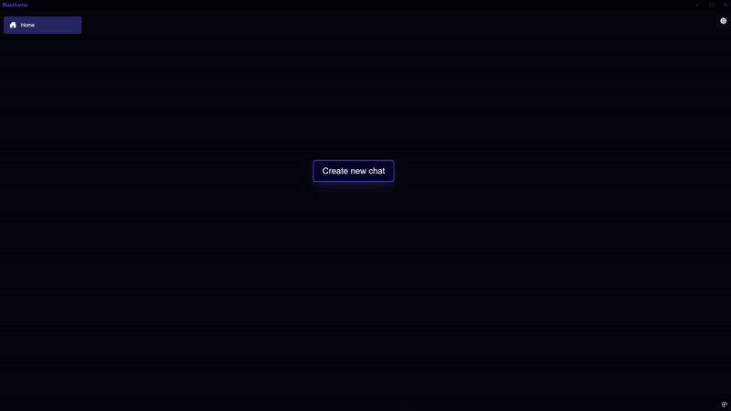
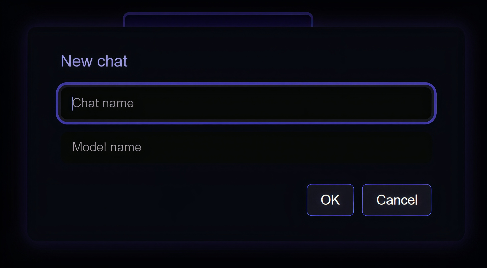
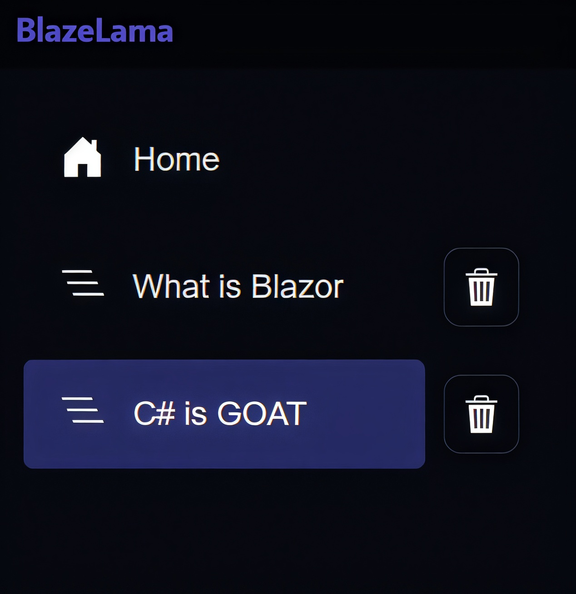
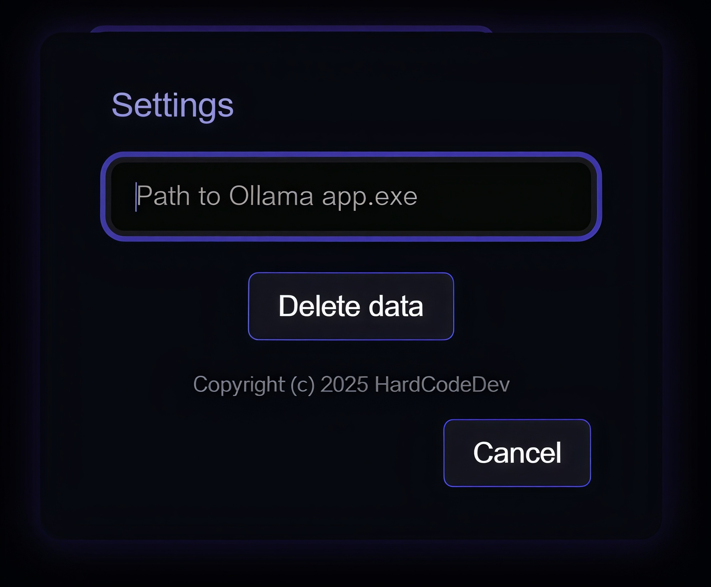



    

# 🦙 BlazeLama

**BlazeLama** is (hopefully) the first user-friendly, lightweight desktop chat client for [Ollama](https://ollama.com), built with **Blazor Server** and **WPF WebView**.

---

## 🚀 Overview

BlazeLama provides a simple and responsive UI for chatting with local Ollama models on Windows. Features include:

- 🗨️ Create and delete chats, assign models to each chat
- 🔧 Automatically launch Ollama when this app starts (if a path is provided in settings)
- 💾 Store chat history and models in local JSON files

It works with any model downloaded via the [Ollama CLI](https://ollama.com/library).

&nbsp;
&nbsp;

---

## 📦 Installation

> **Requirement:** [Download and install Ollama](https://ollama.com) first.

1. Download the latest `.zip` archive from the **Releases** page  
2. Extract it anywhere  
3. Launch `BlazeLamaDesktop.exe`  
4. (Optional) In settings, specify the full path to `ollama.exe` for automatic startup

---

## 🔨 Usage

After launching, you'll see the **Home menu** and a **"Create new chat"** button. Clicking it will open a dialog where you can define:

| Field          | Description                            |
|----------------|----------------------------------------|
| **Chat name**  | Display name for your chat             |
| **Model name** | Model you want to use for this session |

    

&nbsp;
&nbsp;

On the left sidebar, you'll see your chat list and the **Home** button.

> [!WARNING]  
> A chat is saved only after at least one message is sent.

    

&nbsp;
&nbsp;

Messages, model names, and chat titles are stored in the `Data` folder, located next to the executable. Stored as `.json` files.

> [!TIP]  
> If the app fails to load or gets stuck, you can manually delete corrupted data by closing the app and removing all JSON files from the `Data` folder.

&nbsp;

You can delete any chat by clicking the 🗑 icon next to it.

There is **no limit on the number of chats**. The message length and memory limitations depend on the model you use.

---

### ⚙️ Settings

While on the Home screen, click the ⚙️ icon in the top right corner to open the Settings popup:

    

| Setting                   | Description |
|---------------------------|-------------|
| **Path to Ollama app.exe** | If you want BlazeLama to automatically launch Ollama, enter the full path to `ollama.exe` here |
| **Delete data**           | Deletes **all chat data**, including histories, chat names, and model references |

---
## TODO

- [ ]  Refactor some code areas to look cleaner 🙂
- [ ]  Better error handling
---

## 📄 License

This project is licensed under the **MIT License**.  
See [`LICENSE.txt`](LICENSE.txt) for full terms.

---

## 👨‍💻 Author

**HardCodeDev**  
-  [GitHub](https://github.com/HardCodeDev777)  
-  [Itch.io](https://hardcodedev.itch.io/)

---

> 💬 Got feedback, found a bug, or want to contribute? Open an issue or fork the repo on GitHub!